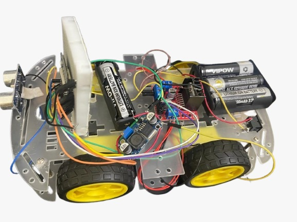
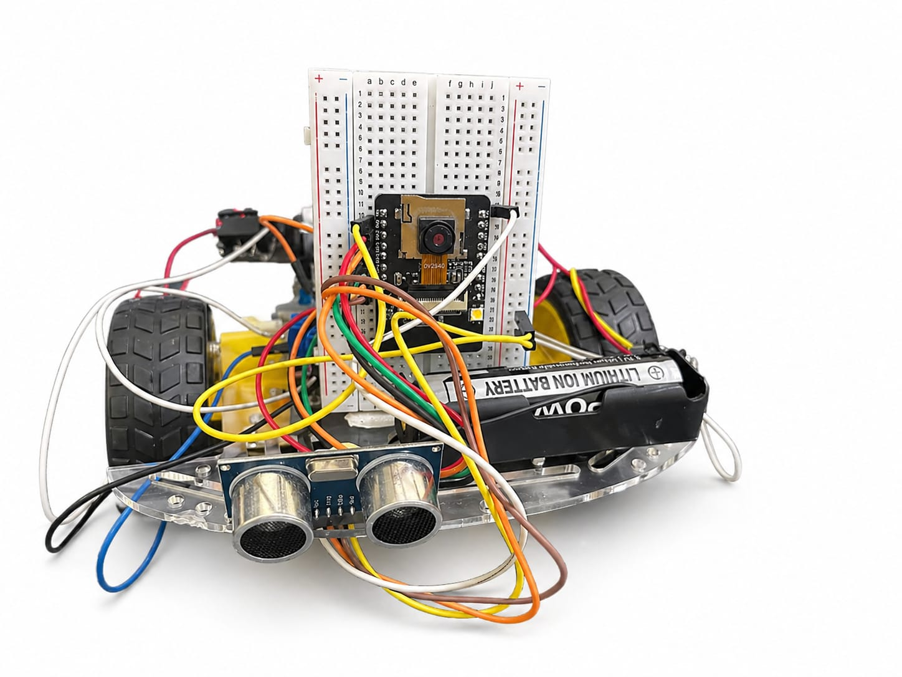

# Swarm Robotics with Embedded Edge AI
Real-Time Object Detection and Cooperative Navigation in Swarm Robotics Using Embedded Edge AI.
[📄 View Full Project Report PDF](./Project%20Report.pdf)
## 📸 Hardware Prototypes

## Hardware Components
- **Master Bot:** ESP32-CAM, L298N Motor Driver, 4WD Chassis
- **Slave Bot:** ESP32, N20 Motors, Li-ion Batteries
- **Sensors:** OV2640 Camera Module, Ultrasonic Sensors

## Edge AI Model
- **Framework:** TensorFlow Lite Micro / Edge Impulse Deployment
- **Objects Detected:** Obstacles, Target markers, and Swarm Agents

## Communication Protocol
- The robots communicate cooperatively using **Wi-Fi HTTP / ESP-NOW** to share real-time navigation coordinates and commands.
